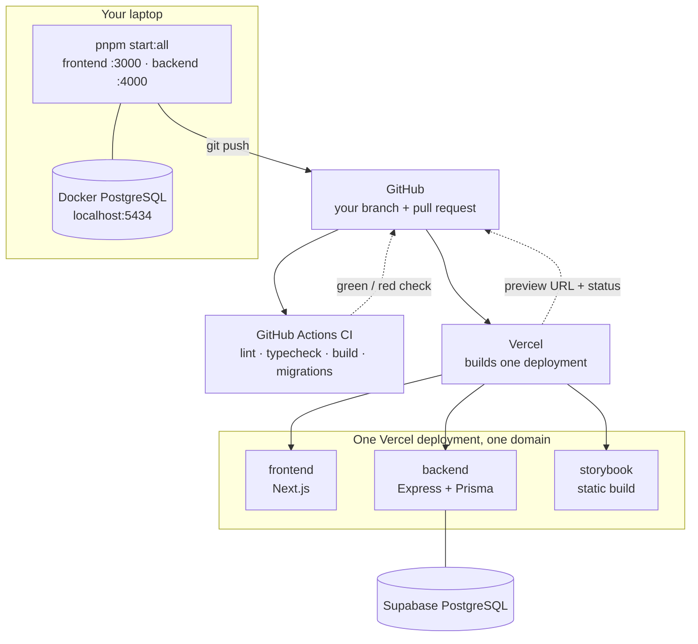

# 🏗️ How ReDiCycle is wired

This document explains the **infrastructure**: what runs where, how your code gets from your
laptop to a live URL, and what to do when something goes red on your pull request.

You do not need a Vercel account to work on this project — everything you need to see happens
on GitHub. This page exists so that "the deployment failed" is never a black box.

- Building features? Start with the [README](./README.md).
- How we work as a team? See [CONTRIBUTING](./CONTRIBUTING.md).

---

## 1. The big picture



Two independent things react to your push: **GitHub Actions** (which checks your code) and
**Vercel** (which builds and deploys it). Both report back onto the pull request.

## 2. One domain, three services

The whole product is a **single Vercel deployment** made of three services, described in
[`vercel.json`](./vercel.json). Requests are routed by path:

| Path             | Service     | What it is            | Built with                                 |
| ---------------- | ----------- | --------------------- | ------------------------------------------ |
| `/storybook/*`   | `storybook` | The component library | `pnpm build-storybook` in `frontend/`      |
| `/api`, `/api/*` | `backend`   | The Express REST API  | `prisma migrate deploy && prisma generate` |
| everything else  | `frontend`  | The Next.js app       | `next build`                               |

Two details that surprise people:

- **The `/api` prefix is not stripped.** Vercel forwards `/api/users` to the backend service as
  `/api/users`, which is why Express mounts its router at `/api`
  ([`backend/src/index.ts`](./backend/src/index.ts)). The upside: the same path works in both
  worlds — `http://localhost:4000/api/users` locally, `/api/users` deployed.
- **`/storybook` (no trailing slash) is redirected to `/storybook/`** before any routing
  happens, because the static build expects to live in a folder.

## 3. Local vs deployed

| Thing     | On your laptop                             | Deployed                         |
| --------- | ------------------------------------------ | -------------------------------- |
| Frontend  | `http://localhost:3000`                    | `/` on the deployment domain     |
| API       | `http://localhost:4000/api`                | `/api` on the same domain        |
| Storybook | `http://localhost:6006` (`pnpm storybook`) | `/storybook/` on the same domain |
| Database  | PostgreSQL in Docker, host port **5434**   | Supabase PostgreSQL              |
| Processes | Two dev servers you start yourself         | One deployment, three services   |

Locally they are three separate servers on three ports; deployed they are one domain. The
frontend does not have to care: it always calls the relative `/api`. In production Vercel routes
that to the backend service, and in development `frontend/next.config.ts` proxies it to
`http://localhost:4000/api`.

## 4. Environment variables, and who sets them

**Locally:** you create them, by copying the examples:

```bash
cp backend/.env.example backend/.env
```

The defaults already match the Docker database, so there is nothing to edit — and the frontend
needs no environment file at all.

**In preview and production:** nobody types them by hand. The **Supabase integration** injects
the database variables into the Vercel project, and Vercel adds its own system variables
(`VERCEL_ENV`, `VERCEL_GIT_COMMIT_SHA`, …). The variable _names_ are deliberately the same in
all three environments, so the same code works everywhere.

| Variable                   | Used for                                                     | Where it comes from                                   |
| -------------------------- | ------------------------------------------------------------ | ----------------------------------------------------- |
| `POSTGRES_PRISMA_URL`      | **Pooled** connection — every query the API makes at runtime | Supabase integration (`.env` locally)                 |
| `POSTGRES_URL_NON_POOLING` | **Direct** connection — migrations only                      | Supabase integration (`.env` locally)                 |
| `CORS_ORIGIN`              | Which origins the API accepts                                | `.env` locally; **must be set** in the Vercel project |
| `PORT`, `HOST`, `PROTOCOL` | The local dev server address                                 | `.env` locally; Vercel handles it deployed            |

**Why two database URLs?** A pooled connection is shared and fast, which is what you want for
short API queries, but it cannot run schema changes. Migrations therefore use the direct
connection. Locally both point at the same container, so the distinction is invisible; on
Supabase they are genuinely different endpoints. The runtime one is wired up in
[`backend/src/libs/prisma.ts`](./backend/src/libs/prisma.ts), the migration one in
[`backend/prisma.config.ts`](./backend/prisma.config.ts).

> [!NOTE]
> Both files rewrite `sslmode=require` to `sslmode=no-verify`. Supabase's pooler presents a
> certificate that is not in Node's trusted list, and without the rewrite every connection
> fails with `SELF_SIGNED_CERT_IN_CHAIN`. It has no effect locally.

## 5. What happens when you push

1. You push your branch and open a pull request.
2. **GitHub Actions** starts three jobs in parallel — Frontend, Backend, Formatting — described
   in [Continuous Integration](./README.md#continuous-integration).
3. **Vercel** starts a build for the same commit and builds all three services.
4. The backend build runs **`prisma migrate deploy`** first: every migration file in
   `backend/prisma/migrations/` that has not been applied yet is applied to the database. Then
   the API is compiled.
5. Vercel comments on your pull request with the status and a **preview URL** — a complete,
   live copy of the product running your branch. If opening it asks you to log in to Vercel,
   say so in Slack: that is a project setting a teacher can turn off.
6. When the PR is merged into `main`, the same sequence runs again against production.

You never run anything by hand against the deployed database. If your change needs a schema
change, the migration file in your PR _is_ the deployment step — see
[Changing the database schema](./README.md#changing-the-database-schema).

> [!WARNING]
> Preview deployments talk to a real, shared database. A migration that drops or renames a
> column with data in it affects everyone's preview as soon as it is deployed. Say so in Slack
> before you merge one. A migration that fails halfway is recorded as failed and **blocks every
> later deployment** until someone clears it with `prisma migrate resolve` — so test it against
> a fresh local database first (`pnpm db:reset && pnpm db:deploy`).

## 6. CI and Vercel: who catches what

They overlap on purpose. CI runs almost exactly what the Vercel build runs, but against a
throwaway PostgreSQL container — so it fails **fast, safely, and with logs you can read**.

> [!IMPORTANT]
> The CI jobs are **not running yet**, so for now nothing checks your branch before Vercel
> does. Run the checks locally (see [Before you ask for a
> review](./CONTRIBUTING.md#before-you-ask-for-a-review)) — everything in the "Caught by CI?"
> column below is on you until they are switched on.

| Failure                                                 | Caught by CI?        | Caught by Vercel?     |
| ------------------------------------------------------- | -------------------- | --------------------- |
| Lint / TypeScript errors                                | ✅                   | ✅                    |
| `next build` or Storybook build broken                  | ✅                   | ✅                    |
| A migration that does not apply cleanly                 | ✅                   | ✅                    |
| A schema change with **no migration file**              | ❌ (silently passes) | ❌ (nothing to apply) |
| A missing or wrong environment variable in Vercel       | ❌                   | ✅                    |
| A migration that conflicts with the **real** data       | ❌                   | ✅                    |
| Errors that only happen at runtime, after a green build | ❌                   | ✅ (as a broken page) |

In practice: **if CI is green and Vercel is red, the cause is almost always one of the bottom
three rows.**

## 7. A check went red — what now?

**If a GitHub Actions job is red** — click **Details** next to the check on your PR. The full
log is right there, and every step maps to a command you can run locally:

| Failed step             | Run locally                                             |
| ----------------------- | ------------------------------------------------------- |
| Lint                    | `pnpm lint`                                             |
| Typecheck               | `pnpm typecheck`                                        |
| Build / Build Storybook | `pnpm build` · `pnpm --filter frontend build-storybook` |
| Formatting              | `pnpm format:check` (or `pnpm format` to fix it)        |
| Apply the migrations    | `pnpm db:reset`, then `pnpm db:deploy`                  |
| Run the seed            | `pnpm db:seed`                                          |

**If the Vercel check is red**, its PR comment tells you _which_ service failed. Start by
reproducing it locally — the build commands above are the same ones Vercel runs, so most build
failures show up on your machine immediately. Then check the rows in the table above that CI
cannot catch:

- Did you add a new environment variable that only exists in your local `.env`? It has to be
  added to the Vercel project too — ask in Slack.
- Did your migration succeed locally against an empty database, but the real one already has
  data? Rows that violate a new constraint will fail there and only there.

**If you still cannot tell why**, post the PR link in Slack. The full Vercel build log needs a
Vercel account, so a teacher will read it and paste the relevant part into your PR. Do not sit
on it — this is a two-minute favour for whoever has access.

## 8. Things that will trip you up

- **Node 24 is not a suggestion.** `.npmrc` sets `engine-strict=true`, so `pnpm install` fails
  outright on an older Node instead of warning. `nvm use` reads `.nvmrc`.
- **The Prisma client is generated code**, written to `backend/generated/prisma` and not
  committed. If imports from `generated/prisma` suddenly break — usually after `pnpm clean` —
  run `pnpm --filter backend db:generate`.
- **`schema.prisma` has no database URL.** From Prisma 7 on, the connection lives in
  `backend/prisma.config.ts`.
- **`pnpm clean` does not reinstall.** It deletes `node_modules` and build output; run
  `pnpm install` afterwards yourself.
- **`pnpm db:reset` returns before PostgreSQL is actually ready.** If the next command fails
  with "Can't reach database server", wait a couple of seconds and run it again.
- **The database is on host port 5434**, not the usual 5432, so it does not collide with a
  PostgreSQL you may already have installed.
- **Storybook is served under `/storybook/` only when deployed.** Locally it runs at the root of
  port 6006, so a path bug there will not show up until the preview is built.
